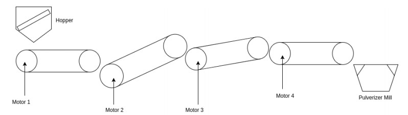
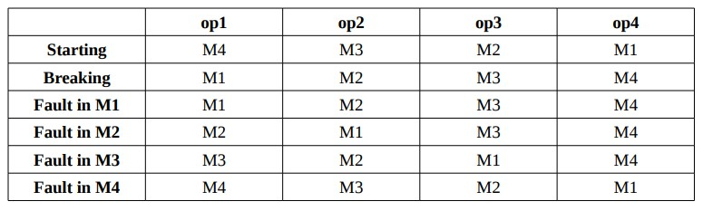

# motor-seq-control
Sequential control of DC motors using Atmega8 microcontroller

## Introduction
Sequential control makes motors to start or stop in a pre-determined order. One motor cannot
start until some other motor is already in operation, sequential control have many industrial
applications like in Air-condition and other compressor driven equipments, hydraulic press and
especially in belt conveyers.

## Compilation

## Schematic

